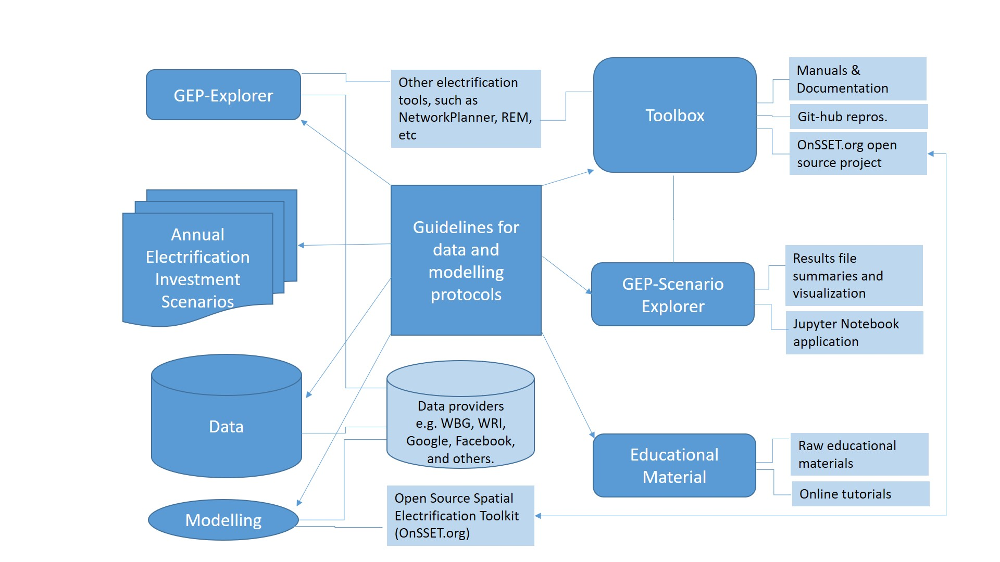

Overview
=================================

Scope
****************
The GEP is a portal for electrification investment data, analysis and research. The project output is primarily accessible investment outlooks and flexible software to be used for investment and development planning for on-, off- and mini-grid electricity access.
The GEP is being developed, updated and used in an open and transparent way leading to several disruptive co-benefits:

 * By jointly developing guidelines, many disparate practitioners, practice, software and data can be aligned and streamlined.
 * By making the tools and data open, accessible and inclusive of partners (consisting of different task-groups), a community of practice will be extended.
 * By ensuring interoperability with other efforts, new data, results and methods can be incorporated. This will allow for integration with complementary efforts, following the developed standards.
 * By means of modular configuration through which different targets will be reached; data and method updates will be possible on the fly; and various aspects of the GEP development can take place in parallel.
 * By means of regular annual updates, new results and methods will be absorbed as they emerge and it is envisioned that these will be important as energy efficient appliances (continue to) develop, smart grids and metering evolve, integration with ICT networks and ‘sale of service’ models evolve etc.

The GEP audience
******************
The GEP has four primary target audiences. These include:
 * **‘High level decision makers’** will use output from the GEP “Explorer” that produces geo-infographics investment options for all target countries.
 * **‘Policy and investment analysts’** will use the GEP “Scenario generator” to develop tailored scenarios to meet specific policy or investment goals.
 * **‘Data producers and ICT developers’** will use the GEP “Toolbox” and have a target into which additional information and methods can be utilized (with global impact).
 * **‘Global development organizations’** will have a platform for country outreach. The software provides a springboard for tailored analysis and engagement from academia to project developers.

